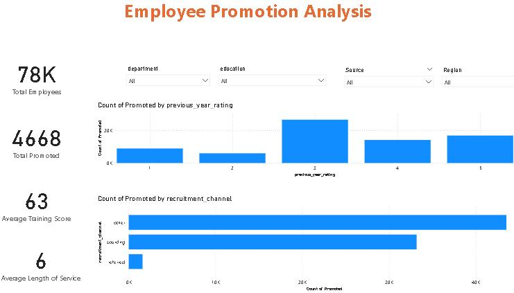
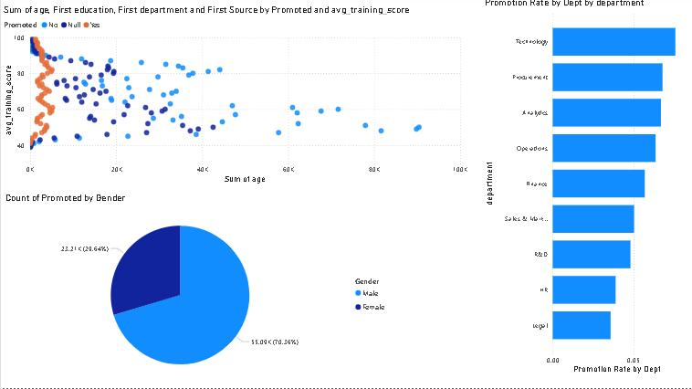

# 💼 Employee Promotion Analytics – Power BI Project

🚀 A complete **Power BI Dashboard** built from scratch to analyze **Employee Promotions**.  
This project uncovers the key factors influencing employee promotions using data-driven insights.  

---
## 📅 Project Duration
**Jul 2025– Jul 2025**

---

## 🔍 Key Insights
- 📊 Promotion Rate by **Department, Gender, and Region**  
- 🎓 Training Effectiveness vs Promotion  
- 🏆 Impact of **Awards & Ratings** on Promotion Likelihood  
- 🎛️ Interactive filtering & slicers for employee trends  

---

## 🛠️ Skills Applied
- Power Query Transformations  
- DAX Measures (Promotion Rate, Avg Score, etc.)  
- Data Modeling & Relationships  
- Dashboard Design & Storytelling with Power BI  

---

## 📸 Dashboard Preview
 
 

---

## 🎯 Business Question Answered
**What factors influence employee promotions?**  
This dashboard helps HR teams and management identify which variables (training, awards, ratings, etc.) significantly impact promotions.  

---

## 📂 Files
- `Employee_Promotion.pbix` → Full Power BI file (optional upload)  
- `screenshots/` → Dashboard preview images  

---

## 🔗 Connect
If you’d like a personalized version or the PBIX file, feel free to connect with me:  
👉 [LinkedIn – Muhammad Affaf](https://www.linkedin.com/in/muhammadaffaf/)  

---

### Tags
`#PowerBI` `#EmployeeAnalytics` `#HRAnalytics` `#DashboardDesign` `#DataAnalysis`
